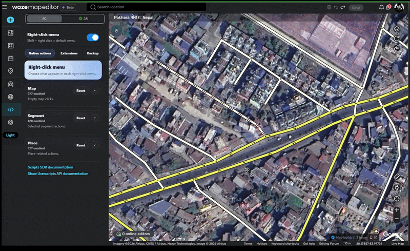

# Waze Parallel Segments

A Tampermonkey userscript for the [Waze Map Editor](https://www.waze.com/editor) that:

- **Splits** two-way road segments into parallel one-way carriageways, and
- **Adjusts** existing one-way segments to be parallel to a user-drawn guide line.

Supports both **left-hand traffic (LHT)** and **right-hand traffic (RHT)** countries with automatic side detection.

## Features

### Split two-way roads

- **Split two-way roads** — Converts a two-way segment into two parallel one-way segments.
- **Configurable gap distance** — Choose from 5 to 45 meters between the parallel carriageways.
- **Multi-segment chaining** — Select multiple connected segments to split an entire road in one operation. Segments are automatically ordered from end to end.
- **Lane count awareness** — Only splits segments with equal (or zero) defined lanes on both sides.

### Make it parallel

- **Guide-line driven alignment** — Select two or more one-way segments, draw a guide line on the map, and the segments are reshaped to become parallel to it at the specified distance.
- **Curve following** — Segments follow the guide line's curvature (offset-line slicing), so they stay smooth instead of kinking.
- **Automatic side assignment** — Segments are placed on the correct side of the guide line; independent chains on the same side are spread outward into a parallel pair.
- **Cancellable drawing** — Pressing Escape while drawing the guide line silently cancels the operation.

### Shared

- **Traffic side auto-detection** — Automatically detects whether the country uses LHT or RHT via the WME SDK's segment → street → city → country chain (with viewport-based fallback). Carriageways are placed on the correct physical side of the road.
- **Pedestrian road exclusion** — Pedestrian road types are automatically skipped.
- **Script update monitoring** — Checks for new versions on GreasyFork.

## Installation

1. Install the [Tampermonkey](https://www.tampermonkey.net/) browser extension.
2. Install the script from [GreasyFork](https://greasyfork.org/en/scripts/491466-waze-parallel-segments).
3. The script will automatically load when you open the [Waze Map Editor](https://www.waze.com/editor).

## Usage

### Single Segment
1. Select a two-way road segment in the WME.
2. The **"Distance between the two parallel segments"** dropdown and **"Split the segments"** button appear in the segment edit panel.
3. Choose the desired gap distance and click **"Split the segments"**.

### Multiple Segments (Chain)
1. Select multiple connected two-way segments **sequentially** (from one end of the road to the other).
2. A confirmation dialog will remind you to verify the result after splitting.
3. Click **"Continue"** to proceed. The script will automatically order the segments, split each one, and connect the resulting parallel segments with junction nodes.

> ⚠️ **Always verify the results** after a multi-segment split — especially turn restrictions at the newly created junction nodes.

### Make It Parallel
1. Select **two or more one-way segments** (e.g. the two carriageways of a divided road you want to realign).
2. Click **"Make it parallel"** in the segment edit panel.
3. **Draw a guide line** on the map. It must extend past both ends of the selected segments (a small clearance at each end is required).
4. If you selected more than two segments, a confirmation dialog will appear — click **"Continue"** to proceed.
5. The segments are reshaped to become parallel to the guide line at the chosen gap distance. Press **Escape** while drawing to cancel.

> 💡 **Tip:** Draw the guide line between the two sides without crossing them — the script figures out which side each segment is on and spreads independent chains outward as a parallel pair.

## How It Works

1. **Select a segment** — When you select a two-way road in the editor, the script shows a distance picker plus **"Split the segments"** and **"Make it parallel"** buttons in the side panel (buttons appear based on the selection type).
2. **Detect driving side** — The script automatically figures out whether the country drives on the left (LHT) or right (RHT), so the new carriageways are placed on the correct side of the road.
3. **Split the road in half** — The selected segment is cut at its midpoint, creating two shorter segments.
4. **Offset each half** — Each half is shifted sideways (perpendicular to the road) to create two parallel lines. The direction of the shift depends on the driving side:
   - **LHT countries**: left half shifts left, right half shifts right.
   - **RHT countries**: the sides are swapped so carriageways are on the correct physical sides.
5. **Apply the new geometry** — The two new segments get their updated shapes.
6. **Set direction** — Both segments are set to **one-way** (A→B), so traffic flows in opposite directions on each carriageway.
7. **Enable turns** — Turns are activated at all junction nodes so traffic can enter and exit the new roads.
8. **Connect multiple segments** — If you selected more than one connected segment, the script also creates junction nodes between the parallel carriageways at each connection point.

### Make It Parallel

1. **Draw a guide line** — After clicking **"Make it parallel"**, the script uses `sdk.Map.drawLine()` to let you draw a reference line on the map.
2. **Validate** — The line is checked to ensure it is longer than the selected segment span (with a minimum clearance at each end).
3. **Detect sides** — Each segment's side (left/right of the guide line) is determined from its midpoint.
4. **Group into chains** — Independent chains of connected segments are detected. If exactly two chains exist on the same side, the closer one is flipped so they spread outward as a parallel pair.
5. **Make chains consistent** — Mixed-side segments within a chain are forced to the chain's majority side to avoid cross-side node collapse.
6. **Slice & offset** — The guide line is sliced per side, offset by half the chosen distance, and each segment is reshaped to follow its slice.
7. **Move nodes & update geometry** — Junction nodes are repositioned from the slice endpoints and all segment geometries are updated, then turns are re-allowed at every modified node. The whole operation supports full undo.

## Technical Details

- **API**: Fully migrated to the [WME SDK](https://www.waze.com/editor/sdk) — no legacy `Waze/Action/*` actions except `AddNode` (which has no SDK replacement for multi-segment junctions).
- **Geometry**: All point-offset math uses [Turf.js](https://turfjs.org/) (WGS84 coordinate space). Line intersection helpers remain as plain JS functions.

## Changelog Highlights

| Version | Changes |
|---------|---------|
| 2026.08.04.01 | Continued "Make it parallel" refinements — stable chain-side handling, no segment shortening, aligned junction nodes across lanes. |
| 2026.07.26.02 | **Added "Make it parallel" feature** — select one-way segments, draw a guide line, and they become parallel at the specified distance. |
| 2026.07.27.01–11 | Series of "Make it parallel" fixes: kinking on curves, cross-side distortion, overlap on same-side chains, chain-side swapping, per-side projection ranges, and cross-side node alignment. |
| 2026.06.29.01 | Fixed lane count detection; segments with equal defined lanes on both sides can now be split. |
| 2026.03.31.01 | Fixed broken country detection for segment-address-based lookup; uses `sdk.Countries.getTopCountry()` as primary method. |
| 2026.03.30.08 | Fixed RHT detection caching bug that caused RHT countries to be treated as LHT after editing in an LHT country. |
| 2026.03.30.07 | Added LHT/RHT traffic side detection; bearing offsets swapped for RHT countries. |
| 2026.03.30.01 | Full migration from legacy WME API + OpenLayers to WME SDK + Turf.js. |
| Earlier | Original implementation by J0N4S13 using legacy WME API and OpenLayers. |

## Author

- **kid4rm90s & Copilot** — WME SDK migration and ongoing development.
- **J0N4S13** ([jonathanserrario@gmail.com](mailto:jonathanserrario@gmail.com)) — Original author.

## License

[MIT License](LICENSE)
